<!-- ==========================================================================
     Analysis_Results.Rmd
     Comparative analysis of univariate, M-model and coregionalization
     approaches for Bayesian disease mapping.
     --------------------------------------------------------------------------
     TFM en Bioestadística — María Barrera Cruz
     Universidad de Valencia, Facultad de Matemáticas, 2026
     Tutor: Miguel Ángel Martínez-Beneito (Dept. Estadística e Investigación Operativa, UV)
     --------------------------------------------------------------------------
     REPRODUCIBILITY NOTE:
     This document loads pre-computed posterior summaries from data/RData/.
     The underlying mortality data (observed and expected counts) are not
     included in this repository due to data protection restrictions
     (Conselleria de Sanitat / INE). The model fitting scripts are in
     models/ and require access to those data to be re-run.
     ========================================================================== -->

```{r setup, include=FALSE}
knitr::opts_chunk$set(
  echo    = TRUE,
  message = FALSE,
  warning = FALSE,
  fig.align = "center"
)
```

```{r packages}
library(ggplot2)
library(dplyr)
library(tidyr)
library(stringr)
library(ggrepel)
library(spdep)
library(patchwork)
library(cowplot)
library(RColorBrewer)
library(MCMCvis)
library(broom)
library(sp)
library(car)

# El Rmd se ejecuta desde analysis/; las rutas son relativas a la raíz del repo.
# Rutas relativas a la raíz del repositorio, no al directorio de trabajo
# repo_root <- normalizePath(file.path(dirname(knitr::current_input()), ".."))
```

---

## 0. Carga de datos y objetos precalculados

```{r load-data}
# ── Cartografía (pública) ─────────────────────────────────────────────────────
load("data/spatial/CartoMunis542.RData")   # objeto: carto_munis

# ── Nombres de enfermedades ───────────────────────────────────────────────────
# Códigos INE de las 78 causas de mortalidad prematura (Anexo A del TFM).
# Columnas 1:47 = hombres, 48:78 = mujeres.
names_causes <- c(
  "004","006","009","010","011","012","013","014","015","016",
  "017","018","028","030","031","033","035","036","037","041",
  "044","045","046","051","052","054","055","056","057","058",
  "059","061","063","064","067","071","072","077","082","086",
  "089","090","092","093","095","097","098",          # hombres (47)
  "011","012","013","014","015","016","018","023","024","025",
  "026","033","035","036","037","044","045","051","052","055",
  "056","057","058","059","063","064","067","071","072","090","098"  # mujeres (31)
)
nombres_enf <- c(paste0("H_", names_causes[1:47]),
                 paste0("M_", names_causes[48:78]))

# ── Resultados del M-modelo ───────────────────────────────────────────────────
# theta_multi : medias posteriores de theta (542 municipios × 78 enfermedades)
load("data/RData/theta_multi.RData")        # objeto: theta_multi

# ── Resultados univariantes ───────────────────────────────────────────────────
# Theta_mean_UNI : medias posteriores de theta.tot (542 × 78)
# waics.uni      : vector de 78 WAICs individuales
load("data/RData/Theta_mean_UNI.RData")
load("data/RData/waics_uni.RData")

# ── Resultados corregionalización — ordenación original ──────────────────────
# theta_coreg_original : medias posteriores de theta (542 × 78, orden del M-modelo)
# waic_coreg_Original  : WAIC escalar
# var_theta_coreg    : varianza de theta (orden original)
load("data/RData/theta_coreg_original.RData")
load("data/RData/waic_coreg_original.RData")
load("data/RData/var_theta_coreg.RData")


# ── Resultados corregionalización — ordenación directa e inversa ─────────────
# waic_coreg_nCasos  : WAIC escalar (directa)
# waic_coreg_inverso : WAIC escalar (inversa)
load("data/RData/waic_coreg_directa_inversa.RData")

# ── Resultados corregionalización — 50 ordenaciones aleatorias ───────────────
# waic_coreg          : vector de 50 WAICs
# orden_aleatorio_list: lista de 50 vectores de permutación
load("data/RData/waic_coreg_vec.RData")
load("data/RData/orden_aleatorio_list.RData")

# ── WAIC del M-modelo ─────────────────────────────────────────────────────────
load("data/RData/waic_mmodel.RData")

# ── Resultados precalculados de correlación e inflación ──────────────────────
# df_cor                    : data frame largo de correlaciones (3 modelos)
# variabilidad_por_enfermedad: data frame con varianza y rango de inflación
load("data/RData/df_cor.RData")
load("data/RData/variabilidad_por_enfermedad.RData")
```

---

## 1. Ajuste predictivo: WAIC

```{r waic-prep}
waic_uni       <- sum(waics.uni)       # suma de los 78 WAICs univariantes

refs <- data.frame(
  label = c("M-modelo", "Univariantes",
            "Coreg. Original", "Coreg. Directa", "Coreg. Inversa"),
  yval  = c(waic_mmodel, waic_uni,
            waic_coreg_Original, waic_coreg_nCasos, waic_coreg_inverso),
  color = c("#0072B2", "#E69F00", "#009E73", "#CC79A7", "#D55E00"),
  lty   = rep("dashed", 5)
)
```

```{r waic-plot, fig.width=7, fig.height=5}
p_waic <- ggplot(data.frame(waic = waic_coreg_vec), aes(x = "", y = waic)) +
  geom_boxplot(fill = "firebrick", alpha = 0.4, width = 0.4,
               outlier.shape = 16) +
  geom_hline(data = refs,
             aes(yintercept = yval, color = label, linetype = label),
             linewidth = 0.8) +
  scale_color_manual(values = setNames(refs$color, refs$label)) +
  scale_linetype_manual(values = setNames(refs$lty,   refs$label)) +
  labs(
    title  = "Comparación de WAIC entre modelos",
    x      = NULL,
    y      = "WAIC",
    color  = NULL,
    linetype = NULL
  ) +
  theme_minimal() +
  theme(
    legend.position = "bottom",
    axis.text.x     = element_blank(),
    axis.ticks.x    = element_blank()
  )

dir.create("results/output", showWarnings = FALSE)
ggsave("results/output/boxplot_waic.png", plot = p_waic,
       width = 7, height = 5, dpi = 300, bg = "white")
p_waic
```

---

## 2. Estructura de correlación entre enfermedades

```{r correlacion-matrices}
# Las matrices de correlación se construyen desde theta_multi, Theta_mean_UNI y
# theta_coreg_original. df_cor está precalculado y cargado en la sección 0.
# Se recalcula aquí por transparencia.

make_cor_df <- function(mat, modelo) {
  
  # Calcula la matriz de correlación de Pearson entre columnas (enfermedades)
  # mat es 542 × 78 → cor_mat queda 78 × 78
  cor_mat <- cor(mat)
  
  # Asigna los nombres de enfermedad (H_xxx / M_xxx) a filas y columnas
  # Necesario porque cor() hereda los nombres originales de mat, que pueden
  # ser índices numéricos o códigos INE sin prefijo de sexo
  colnames(cor_mat) <- nombres_enf
  rownames(cor_mat) <- nombres_enf
  
  # Convierte la matriz 78 × 78 en data frame para poder manipularla con tidyr
  # Cada columna del data frame corresponde a una enfermedad (enf2)
  df <- as.data.frame(cor_mat)
  
  # Saca los nombres de fila (enf1) como columna explícita,
  # porque pivot_longer los eliminaría al reestructurar
  df$enf1 <- rownames(df)
  
  # Pasa de formato ancho (78 columnas de enfermedades) a formato largo:
  # cada fila = un par (enf1, enf2) con su correlación
  # Resultado: 78 × 78 = 6084 filas por modelo
  df <- tidyr::pivot_longer(df, cols = -enf1,
                            names_to = "enf2", values_to = "cor")
  
  # Añade la columna que identifica el modelo, para poder distinguir
  # las tres matrices cuando se unan con rbind()
  df$Modelo <- modelo
  
  df
}

df_cor <- rbind(
  make_cor_df(Theta_mean_UNI,      "Univariante"),
  make_cor_df(theta_multi,          "M-modelo"),
  make_cor_df(theta_coreg_original, "Coregionalization")
)

save(df_cor, file = "data/RData/df_cor.RData")
```

```{r correlacion-plot, fig.width=12, fig.height=9}
# Líneas de separación entre subgrupos (hombres/mujeres, natural/otras)
# Hombres: posiciones 1-47; naturales H: 1-41, otras H: 42-47
# Mujeres: posiciones 48-78; naturales M: 48-76, otras M: 77-78
sep_HM        <- 47.5
sep_otras_H   <- 41.5
sep_otras_M   <- 47.5 + 29.5   # = 77

cor.plot <- ggplot(df_cor, aes(x = enf1, y = enf2, fill = cor)) +
  geom_tile() +
  scale_fill_gradient2(
    low = "steelblue", mid = "white", high = "firebrick",
    midpoint = 0, limits = c(-1, 1), name = "Correlación"
  ) +
  scale_x_discrete(limits = nombres_enf) +
  scale_y_discrete(limits = rev(nombres_enf)) +
  # Separador H / M
  geom_vline(xintercept = sep_HM,      color = "black", linewidth = 0.6) +
  geom_hline(yintercept = 78 - sep_HM, color = "black", linewidth = 0.6) +
  # Separador naturales / otras (dentro de cada sexo)
  geom_vline(xintercept = sep_otras_H, color = "black", linewidth = 0.3,
             linetype = "dashed") +
  geom_hline(yintercept = 78 - sep_otras_H, color = "black", linewidth = 0.3,
             linetype = "dashed") +
  geom_vline(xintercept = sep_otras_M, color = "black", linewidth = 0.3,
             linetype = "dashed") +
  geom_hline(yintercept = 78 - sep_otras_M, color = "black", linewidth = 0.3,
             linetype = "dashed") +
  facet_wrap(~ factor(Modelo,
                      levels = c("Univariante", "Coregionalization", "M-modelo")),
             ncol = 2,
             labeller = as_labeller(c(
               "Univariante"       = "Univariante",
               "Coregionalization" = "Corregionalización",
               "M-modelo"          = "M-modelo"
             ))) +
  theme_minimal() +
  theme(
    axis.text.x  = element_blank(),
    axis.text.y  = element_blank(),
    axis.ticks   = element_blank(),
    axis.title   = element_blank(),
    legend.position = "right"
  ) +
  labs(title = "Matrices de correlación entre efectos espaciales estimados")

ggsave("results/output/correlacion_plot.png", plot = cor.plot,
       width = 12, height = 9, dpi = 300, bg = "white")
cor.plot
```

### 2.1 Test de Welch: pares cruce-sexo vs. resto

```{r welch-prep}
df_cor <- df_cor %>%
  mutate(
    cod1          = str_extract(enf1, "\\d+"),
    cod2          = str_extract(enf2, "\\d+"),
    sexo1         = str_extract(enf1, "^[HM]"),
    sexo2         = str_extract(enf2, "^[HM]"),
    es_cruce_sexo = (cod1 == cod2) & (sexo1 != sexo2),
    triangulo_sup = enf1 < enf2
  )

df_anova <- df_cor %>%
  filter(triangulo_sup, cor < 1) %>%
  mutate(grupo = ifelse(es_cruce_sexo, "Cruce_sexo", "Resto"))

n_compartidas <- df_anova %>%
  filter(es_cruce_sexo, Modelo == "M-modelo") %>%
  nrow()
```

```{r, Levene-test}
levene_res <- df_anova %>%
  group_by(Modelo) %>%
  group_modify(~ {
    test <- leveneTest(cor ~ as.factor(grupo), data = .x)
    tibble(
      F_value = round(test$`F value`[1], 3),
      p_value = round(test$`Pr(>F)`[1], 4)
    )
  })

knitr::kable(
  levene_res,
  col.names = c("Modelo", "F", "p-valor"),
  caption = "Resultados del test de Levene de homogeneidad de varianzas 
  para cada modelo.",
  booktabs = TRUE
)
```


```{r welch-test}
# Test de Welch por modelo
df_anova %>%
  group_by(Modelo) %>%
  group_modify(~ tidy(t.test(cor ~ grupo, data = .x, var.equal = FALSE))) %>%
  select(Modelo, estimate1, estimate2, statistic, p.value, conf.low, conf.high)
```

```{r welch-tabla}
tabla_grupos <- df_anova %>%
  group_by(Modelo, grupo) %>%
  summarise(
    Media = round(mean(cor), 3),
    SD    = round(sd(cor), 3),
    n     = n(),
    .groups = "drop"
  ) %>%
  mutate(
    Modelo = factor(Modelo,
                    levels = c("Univariante", "M-modelo", "Coregionalization")),
    grupo  = case_when(
      grupo == "Cruce_sexo" ~ "Mismo código (H/M)",
      grupo == "Resto"      ~ "Resto de pares",
      TRUE                  ~ grupo
      )
    ) %>%
  arrange(Modelo, grupo)
```

```{r, boxplot-grupos, fig.width=10, fig.height=5}

outliers_df <- df_anova %>%
  group_by(Modelo, grupo) %>%
  mutate(
    q1  = quantile(cor, 0.25),
    q3  = quantile(cor, 0.75),
    iqr = q3 - q1,
    is_outlier = cor < (q1 - 1.5 * iqr) | cor > (q3 + 1.5 * iqr),
    label = paste0(enf1, "-", enf2)
  ) %>%
  filter(is_outlier)

ggplot(df_anova, aes(x = grupo, y = cor, fill = grupo)) +
  geom_boxplot(outlier.shape = NA, alpha = 0.8, linewidth = 0.3) +  
  geom_text(
    data = outliers_df,
    aes(label = label), 
    size = 2, hjust = -0.1, color = "black"
  ) +
  geom_point(
    data = outliers_df,
    aes(x = grupo, y = cor),
    size = 0.5, color = "black"
  ) +
  stat_summary(fun = mean, geom = "point",
               shape = 23, size = 2, fill = "white", color = "black") +
  facet_wrap(~ factor(Modelo,
                      levels = c("Univariante", "Coregionalization", "M-modelo")),
             ncol = 3,
             labeller = as_labeller(c(
               "Univariante"       = "Univariante",
               "M-modelo"          = "M-modelo",
               "Coregionalization" = "Corregionalización"
             ))) +
  scale_fill_manual(
    values = c("Cruce_sexo" = "steelblue", "Resto" = "gray70"),
    labels = c("Cruce_sexo" = "Mismo código (H/M)", "Resto" = "Resto de pares")
  ) +
  scale_x_discrete(
    labels = c("Cruce_sexo" = "Mismo código\n(H/M)", "Resto" = "Resto\nde pares")
  ) +
  labs(
    title = "Correlaciones entre enfermedades por grupo y modelo",
    y     = "Correlación estimada",
    x     = NULL,
    fill  = NULL
  ) +
  theme_minimal() +
  theme(legend.position = "bottom", strip.text = element_text(face = "bold"))
```

---

## 3. Varianza espacial de los efectos estimados

```{r varianza-prep}
v_UNI   <- diag(cov(Theta_mean_UNI))
v_MULTI <- diag(cov(theta_multi))
v_COREG <- diag(cov(theta_coreg_original))

df_var <- data.frame(
  enfermedad        = nombres_enf,
  var_UNI           = v_UNI,
  var_COREG         = v_COREG,
  var_MULTI         = v_MULTI,
  veces_COREG_mayor = v_COREG / v_MULTI
)

df_long <- rbind(
  data.frame(Modelo = "Corregionalización", enfermedad = nombres_enf, var = v_COREG),
  data.frame(Modelo = "M-modelo",           enfermedad = nombres_enf, var = v_MULTI),
  data.frame(Modelo = "Univariante",         enfermedad = nombres_enf, var = v_UNI)
) %>%
  mutate(Modelo = factor(Modelo,
                         levels = c("Univariante", "M-modelo", "Corregionalización")))
```

```{r varianza-plot, fig.width=9, fig.height=12}
cols_modelo <- c(
  "Univariante"      = "#ffeaa9",
  "M-modelo"         = "#92c2ff",
  "Corregionalización" = "#c9d6d4"
)

p1 <- ggplot(df_long, aes(x = var, fill = Modelo)) +
  geom_density(alpha = 0.4) +
  scale_x_log10() +
  scale_fill_manual(values = cols_modelo) +
  theme_minimal() +
  labs(title = "Distribución de la varianza espacial de θ (por enfermedad)",
       x = "Varianza [escala log]", y = "Densidad")

p2 <- ggplot(df_var, aes(x = var_MULTI, y = var_UNI)) +
  geom_point(alpha = 0.7) +
  geom_abline(slope = 1, intercept = 0, linetype = 2) +
  scale_x_log10() + scale_y_log10() +
  theme_minimal() +
  labs(title = "M-modelo vs. Univariante",
       x = "Varianza (M-modelo)", y = "Varianza (Univariante)")

p3 <- ggplot(df_var, aes(x = var_MULTI, y = var_COREG)) +
  geom_point(alpha = 0.7) +
  geom_abline(slope = 1, intercept = 0, linetype = 2) +
  scale_x_log10() + scale_y_log10() +
  theme_minimal() +
  labs(title = "M-modelo vs. Corregionalización",
       x = "Varianza (M-modelo)", y = "Varianza (Corregionalización)")

p4 <- ggplot(df_var, aes(x = var_UNI, y = var_COREG)) +
  geom_point(alpha = 0.7) +
  geom_abline(slope = 1, intercept = 0, linetype = 2) +
  scale_x_log10() + scale_y_log10() +
  theme_minimal() +
  labs(title = "Univariante vs. Corregionalización",
       x = "Varianza (Univariante)", y = "Varianza (Corregionalización)")

varianza_plot <- (p1 / p2 / p3 / p4) & theme(legend.position = "none")
legend_fill   <- get_legend(p1 + theme(legend.position = "bottom"))

varianza_plot_final <- plot_grid(
  legend_fill, varianza_plot, ncol = 1, rel_heights = c(0.05, 1)
)

ggsave("results/output/varianza_plot.png", plot = varianza_plot_final,
       width = 9, height = 12, dpi = 300, bg = "white")
varianza_plot_final
```

### 3.1 Inflación de varianza por posición (50 ordenaciones aleatorias)

```{r inflacion-prep}
seeds_disponibles <- 1:50
var_theta_mmodel  <- apply(theta_multi, 2, var)

# Matriz 78 × 50 de varianzas de theta_coreg (en orden original del M-modelo)
var_matrix <- do.call(cbind, var_theta_coreg)
colnames(var_matrix) <- paste0("seed_", seeds_disponibles)

# Ratio de inflación: var(theta_coreg) / var(theta_mmodel)
inflacion_matrix <- sweep(var_matrix, 1, var_theta_mmodel, "/")

# Posición de cada enfermedad (fila) en cada ordenación (columna)
posicion_matrix <- matrix(NA, 78, length(seeds_disponibles))
for (s in seq_along(seeds_disponibles)) {
  posicion_matrix[orden_aleatorio_list[[s]], s] <- 1:78
}

datos_plot <- expand.grid(enfermedad = 1:78,
                          ordenacion = seeds_disponibles) %>%
  mutate(
    inflacion  = as.vector(inflacion_matrix),
    posicion   = as.vector(posicion_matrix),
    var_mmodel = rep(var_theta_mmodel, length(seeds_disponibles))
  )

variabilidad_por_enfermedad <- datos_plot %>%
  group_by(enfermedad) %>%
  summarise(
    inflacion_min   = min(inflacion),
    inflacion_max   = max(inflacion),
    rango_inflacion = max(inflacion) - min(inflacion),
    sd_inflacion    = sd(inflacion),
    var_mmodel      = first(var_mmodel),
    .groups = "drop"
  ) %>%
  arrange(desc(rango_inflacion))

save(variabilidad_por_enfermedad,
     file = "data/RData/variabilidad_por_enfermedad.RData")
```

```{r inflacion-plot, fig.width=12, fig.height=7}
top_enf <- variabilidad_por_enfermedad %>% head(15) %>% pull(enfermedad)

extremos <- datos_plot %>%
  filter(enfermedad %in% top_enf) %>%
  group_by(enfermedad) %>%
  filter(inflacion == max(inflacion) | inflacion == min(inflacion)) %>%
  mutate(etiqueta = paste0("pos.", posicion))

# Etiquetas del eje X: nombre de enfermedad (sin conteos)
etiquetas_x <- nombres_enf[top_enf]

varianza_enfermedad <- datos_plot %>%
  filter(enfermedad %in% top_enf) %>%
  mutate(enfermedad = factor(enfermedad, levels = top_enf)) %>%
  ggplot(aes(x = enfermedad, y = inflacion)) +
  geom_boxplot(fill = "steelblue", alpha = 0.6, outlier.shape = NA) +
  geom_jitter(width = 0.15, size = 2, alpha = 0.7, color = "firebrick") +
  geom_text(data = extremos %>%
              mutate(enfermedad = factor(enfermedad, levels = top_enf)),
            aes(label = etiqueta),
            hjust = -0.2, size = 3, color = "gray30") +
  geom_hline(yintercept = 1, linetype = "dashed", color = "gray30") +
  scale_x_discrete(labels = etiquetas_x) +
  labs(
    title    = "Inflación de varianza espacial por enfermedad y ordenación",
    subtitle = "Cada punto = una ordenación aleatoria. Mismos datos, distinto orden.",
    x        = "Enfermedad (ordenadas por rango de inflación)",
    y        = expression("IR"["js"] ~ "= var(θ_coreg) / var(θ_Mmodelo)")
  ) +
  theme_minimal() +
  theme(axis.text.x = element_text(size = 8, angle = 45, hjust = 1))

ggsave("results/output/varianza_enfermedad.png", plot = varianza_enfermedad,
       width = 12, height = 7, dpi = 300, bg = "white")
varianza_enfermedad
```

### 3.2 Tabla de vulnerabilidad

```{r tabla-vulnerabilidad}
cor_MULTI_b <- cor(theta_multi)
diag(cor_MULTI_b) <- NA
cor_media <- apply(abs(cor_MULTI_b), 1, mean, na.rm = TRUE)
names(cor_media) <- nombres_enf

# colnames(Observados) se sustituye por names_causes (códigos INE, información pública)
tabla_vuln <- variabilidad_por_enfermedad %>%
  mutate(
    nombre_enf = names_causes[enfermedad],
    enf_label  = nombres_enf[enfermedad],
    cor_media  = cor_media[enf_label]
  ) %>%
  select(nombre_enf, var_mmodel, cor_media, rango_inflacion)

bind_rows(
  tabla_vuln %>% head(5) %>% mutate(grupo = "Mayor rango de inflación"),
  tabla_vuln %>% tail(5) %>% mutate(grupo = "Menor rango de inflación")
) %>%
  select(grupo, nombre_enf, var_mmodel, cor_media, rango_inflacion) %>%
  rename(
    Grupo               = grupo,
    `Cód. INE`          = nombre_enf,
    `Varianza (M-modelo)`  = var_mmodel,
    `Correlación media` = cor_media,
    `Rango de inflación` = rango_inflacion
  ) %>%
  knitr::kable(digits = 4,
               caption = "Enfermedades con mayor y menor rango de inflación de varianza
               espacial entre las 50 ordenaciones aleatorias, junto con la varianza
               intrínseca bajo el M-modelo y su correlación media con el resto.")
```

---

## 4. Autocorrelación espacial: I de Moran

```{r moran}
lw1 <- nb2listw(Veci, style = "W")
J   <- 78

tabla_moran <- data.frame(
  enfermedad  = nombres_enf,
  Ord1_COREG  = NA_real_,
  Ord1_MULTI  = NA_real_
)

for (j in 1:J) {
  tabla_moran$Ord1_COREG[j] <-
    moran.test(theta_coreg_original[, j], lw1)$estimate["Moran I statistic"]
  tabla_moran$Ord1_MULTI[j] <-
    moran.test(theta_multi[, j],          lw1)$estimate["Moran I statistic"]
}
```

```{r moran-plot, fig.width=10, fig.height=7}
I_Moran <- ggplot(tabla_moran, aes(x = Ord1_COREG, y = Ord1_MULTI)) +
  geom_abline(slope = 1, intercept = 0, linetype = 2, color = "gray50") +
  geom_point(alpha = 0.7) +
  geom_text_repel(aes(label = enfermedad), size = 3, max.overlaps = Inf) +
  theme_minimal() +
  labs(
    title = "Autocorrelación espacial: Corregionalización vs. M-modelo",
    x     = "I de Moran (Corregionalización, orden original)",
    y     = "I de Moran (M-modelo)"
  )

ggsave("results/output/I_Moran.png", plot = I_Moran,
       width = 12, height = 7, dpi = 300, bg = "white")
I_Moran
```

---

## 5. Mapas de efectos espaciales estimados

Las funciones siguientes generan los mapas comparativos (Univariante | Corregionalización | M-modelo) para una enfermedad dada, con escala de color común entre los tres modelos.

```{r map-functions}
guardar_mapa_theta <- function(enfermedad_idx, nombre_archivo) {

  todos_theta <- c(theta_multi[, enfermedad_idx],
                   theta_coreg_original[, enfermedad_idx],
                   Theta_mean_UNI[, enfermedad_idx])

  # Breaks simétricos respecto al cero, recortando el 1% más extremo
  lim <- quantile(abs(todos_theta), 0.99, na.rm = TRUE)
  breaks_comunes <- c(min(todos_theta, na.rm = TRUE),
                      seq(-lim, lim, length.out = 8),
                      max(todos_theta, na.rm = TRUE))
  breaks_comunes <- sort(unique(breaks_comunes))

  # Paleta invertida: marrón = riesgo alto, verde-azul = riesgo bajo
  pal      <- rev(brewer.pal(9, "BrBG"))
  etiqueta <- nombres_enf[enfermedad_idx]

  png(paste0("results/output/", nombre_archivo, ".png"),
      width = 14, height = 6, units = "in", res = 300)
  layout(matrix(c(1, 2, 3, 4), nrow = 1), widths = c(3, 3, 3, 1.8))
  par(mar = c(2, 1, 2, 0.5))

  plot(carto_munis,
       col  = pal[cut(Theta_mean_UNI[, enfermedad_idx],
                      breaks = breaks_comunes, include.lowest = TRUE)],
       main = "Univariante", sub = etiqueta)

  plot(carto_munis,
       col  = pal[cut(theta_coreg_original[, enfermedad_idx],
                      breaks = breaks_comunes, include.lowest = TRUE)],
       main = "Corregionalización", sub = etiqueta)

  plot(carto_munis,
       col  = pal[cut(theta_multi[, enfermedad_idx],
                      breaks = breaks_comunes, include.lowest = TRUE)],
       main = "M-modelo", sub = etiqueta)

  par(mar = c(2, 0, 2, 0.5))
  plot.new()
  legend("center",
         legend = paste0(round(breaks_comunes[-length(breaks_comunes)], 3),
                         " – ",
                         round(breaks_comunes[-1], 3)),
         fill   = pal,
         title  = expression(hat(theta)[ij]),
         bty    = "n", cex = 0.9, y.intersp = 1.0)
  dev.off()
  cat("Guardado:", nombre_archivo, "\n")
}
```

```{r mapas-theta}
# Enfermedades con mayor discrepancia en I de Moran
guardar_mapa_theta(77, "mapa_M090")
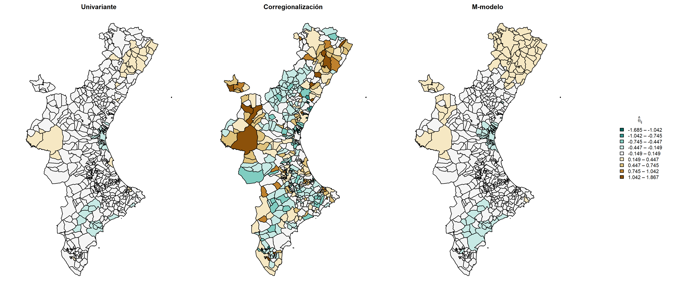

guardar_mapa_theta(58, "mapa_M026")
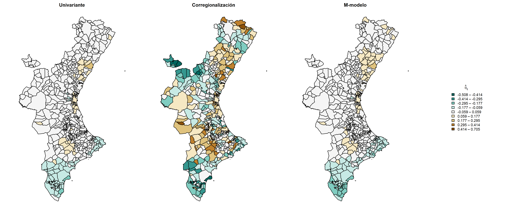

guardar_mapa_theta(49, "mapa_M012")
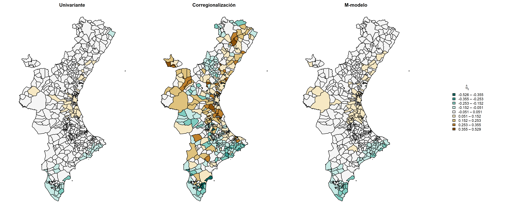

guardar_mapa_theta(6,  "mapa_H012")
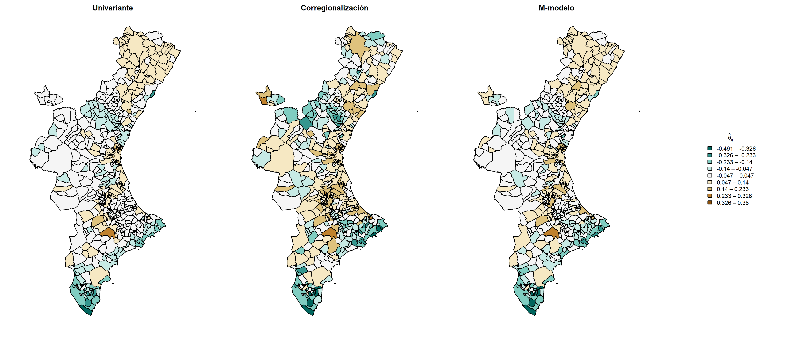

# Enfermedades con confluencia de factores: baja varianza + posición tardía
guardar_mapa_theta(74, "mapa_M067")
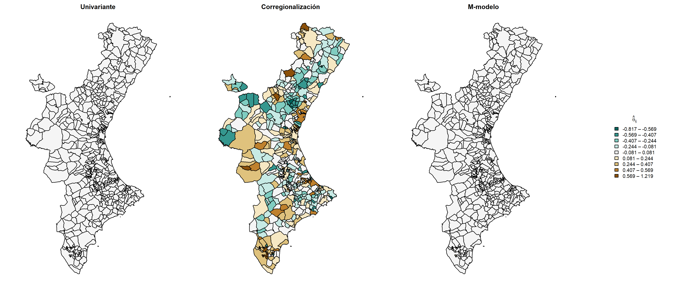

guardar_mapa_theta(35, "mapa_H067")
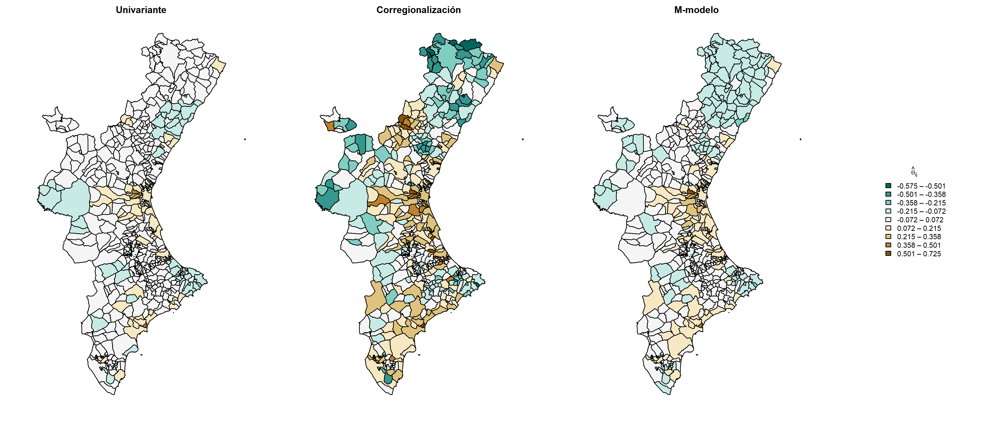

# Enfermedades con discrepancia moderada
guardar_mapa_theta(36, "mapa_H071")
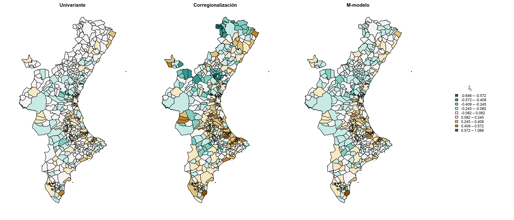

guardar_mapa_theta(28, "mapa_H056")
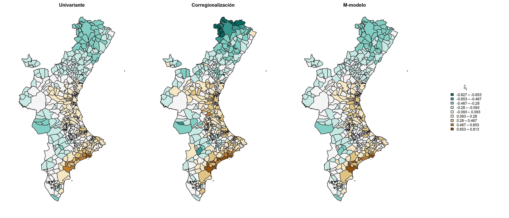
```

```{r probpos-calc}
# P(theta_ij > 0) se calcula desde los objetos MCMC completos.
# Estos objetos son grandes y no se incluyen en el repositorio.
# Las matrices de probabilidad precalculadas se cargan desde data/RData.
load("data/RData/prob_pos_matrix.RData")       # objeto: prob_pos_matrix       (M-modelo)
load("data/RData/prob_pos_matrix_coreg.RData") # objeto: prob_pos_matrix_Coreg (Coreg.)
```

```{r map-probpos-map}
guardar_mapa_probpos <- function(Enfermedad, nombre_archivo) {

  pal_prob <- c("#4575b4",   # azul oscuro:   claramente por debajo  (0.0–0.2)
                "#91bfdb",   # azul claro:    probablemente por debajo (0.2–0.4)
                "#ffffbf",   # amarillo pálido: incierto              (0.4–0.6)
                "#fc8d59",   # naranja:        probablemente por encima (0.6–0.8)
                "#d73027")   # rojo oscuro:    claramente por encima   (0.8–1.0)
  breaks_prob   <- c(0, 0.2, 0.4, 0.6, 0.8, 1)
  legend_labels <- c("Claramente por debajo (0.0–0.2)",
                     "Probablemente por debajo (0.2–0.4)",
                     "Incierto (0.4–0.6)",
                     "Probablemente por encima (0.6–0.8)",
                     "Claramente por encima (0.8–1.0)")

  png(paste0("results/output/", nombre_archivo, ".png"),
      width = 10, height = 6, units = "in", res = 300)

  layout(matrix(c(1, 2, 3), nrow = 1), widths = c(3, 3, 1.2))
  par(mar = c(2, 1, 2, 0.5))

  plot(carto_munis,
       col  = pal_prob[cut(prob_pos_matrix_Coreg[, Enfermedad],
                           breaks = breaks_prob, include.lowest = TRUE)],
       main = "Corregionalización",
       sub  = nombres_enf[Enfermedad])

  plot(carto_munis,
       col  = pal_prob[cut(prob_pos_matrix[, Enfermedad],
                           breaks = breaks_prob, include.lowest = TRUE)],
       main = "M-modelo",
       sub  = nombres_enf[Enfermedad])

  par(mar = c(2, 0, 2, 0.5))
  plot.new()
  legend("center",
         legend    = legend_labels,
         fill      = pal_prob,
         title     = expression(P(theta[ij] > 0)),
         bty       = "n",
         cex       = 0.75,
         y.intersp = 1.1)

  dev.off()
  cat("Guardado:", nombre_archivo, "\n")
}
```


```{r mapas-probpos}
guardar_mapa_probpos(77, "probM090")
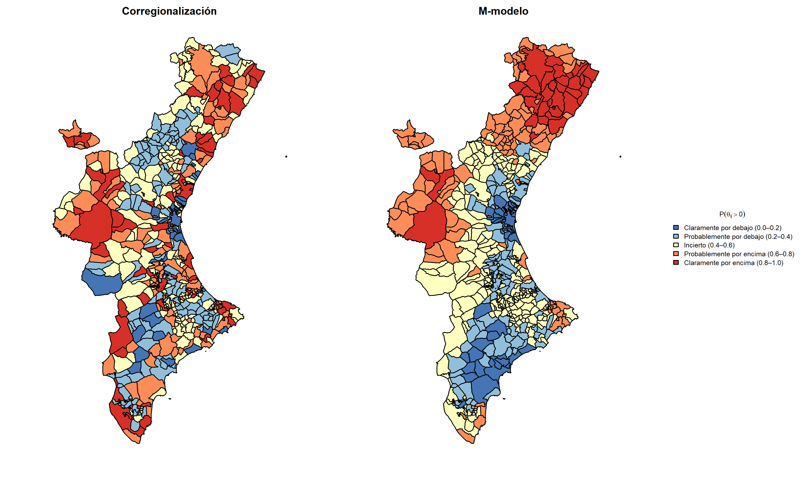

guardar_mapa_probpos(58, "probM026")
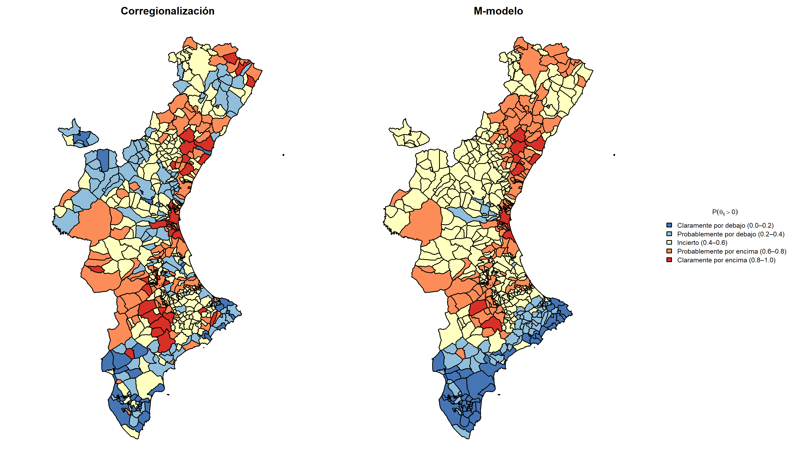

guardar_mapa_probpos(49, "probM012")
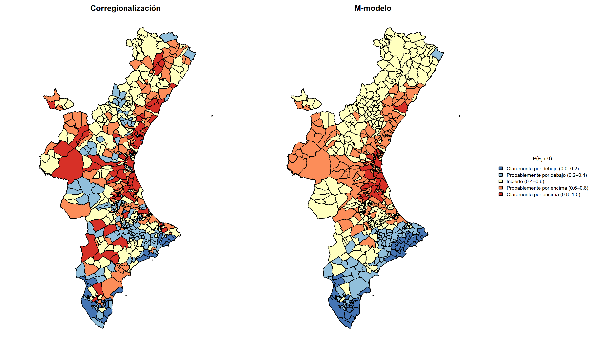

guardar_mapa_probpos(6,  "probH012")
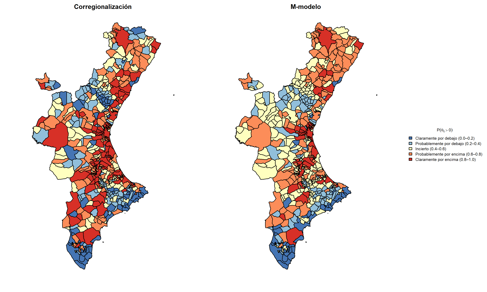

guardar_mapa_probpos(74, "probM067")
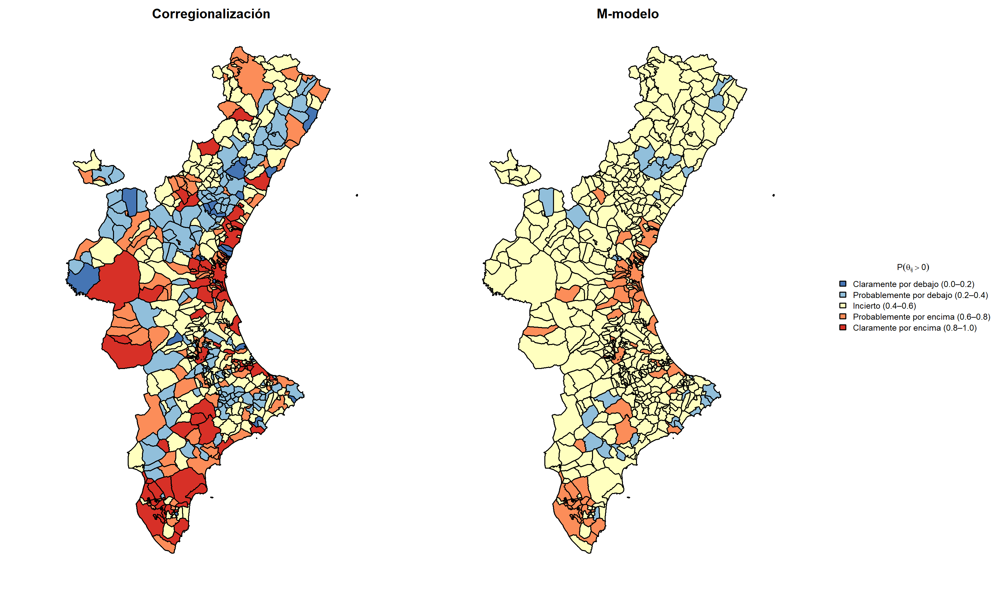

guardar_mapa_probpos(35, "probH067")
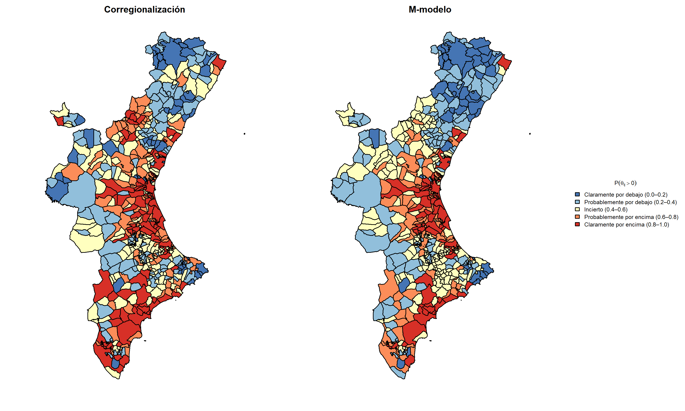

guardar_mapa_probpos(36, "probH071")
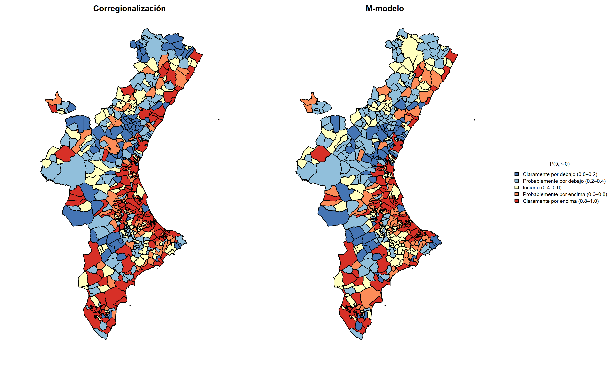

guardar_mapa_probpos(28, "probH056")
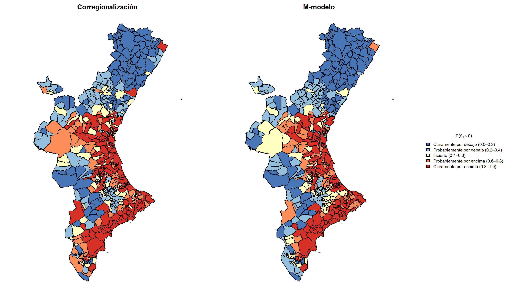
```

---